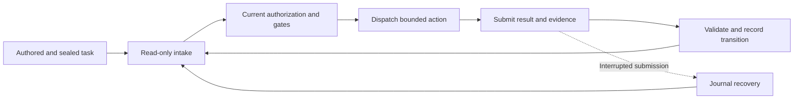

# Gastropact 蝸契

A local Python CLI for traceable AI-assisted work across sessions, people, and agents.

[繁體中文](README.zh-tw.md)


> **Traceable work. Grounded handoffs.** Great fried rice needs wok hei; great projects need Gastropact.

[](#start-here)
[](#commands-and-compatibility)
[](LICENSE)

Gastropact is a local Python CLI built on the TaskContracts protocol for developers coordinating AI-assisted work across sessions, people, and agents. It preserves the authorized objective, records progress, checks submitted evidence, and helps recover interrupted state transitions.

A new participant can answer four questions: **What was authorized? What is recorded as complete? What comes next? What evidence or approval is still required?**

> Development preview, distributed as source. The local verification gate has passed on Windows and Ubuntu WSL2, including Linux POSIX checks. Remote CI and physical power-loss acceptance remain unverified. See [limits](#scope-and-limits) before adoption and [MIT license](LICENSE) for reuse terms.

The snail represents work that leaves a trace: just as its mucus trail marks where it has traveled, TaskContracts preserves records of task progress and state transitions for later inspection and handoff.


[Start here](#start-here) · [Development problems](#problems-it-addresses) · [Workflow](#how-a-task-moves-forward) · [Verification](#verification-status) · [Limits](#scope-and-limits)

## Start here

Clone the source, then inspect the two command-line interfaces without changing a task:

```shell
git clone https://github.com/pingqLIN/Gastropact.git
cd Gastropact
python scripts/task_contract.py --help
python scripts/task_orchestrator.py --help
```

These read-only help commands expose the core contract and automation interfaces. See [commands and compatibility](#commands-and-compatibility) for their responsibilities and version boundaries.

Runtime requires Python 3.11 or later and uses the Python standard library. Git must be available for repository-bound checks. The repository verification gate additionally needs Node.js/npm, the pinned Ajv dependency, and PowerShell (`pwsh`); CI is configured for Python 3.12 and Node.js 22.

For an existing, authored task bundle, inspect `TASK.json` and `STATE.json` first. Use `resume --help` to see the required task-directory and project-root arguments. `RESUME_OK` means intake validation succeeded; it does **not** grant execution approval. Missing or inconsistent authority produces `STOP`.

## Problems it addresses

| Development problem | Implemented response | Practical outcome |
| --- | --- | --- |
| A new session loses the objective, constraints, or stopping point. | A sealed contract and a separate progress snapshot survive the conversation. | The receiver can inspect the task without reconstructing authority from chat history. |
| A small change expands into unrelated edits or unapproved operations. | Allowed actions, forbidden actions, path limits, and action-bound approvals constrain dispatch and acceptance. | Missing or mismatched authority is rejected in the supported protocol. |
| Work resumes in the wrong checkout or against unexpected changes. | Project/Git bindings and an observed index/worktree baseline are checked. | Wrong state, unreported changes, and out-of-scope result deltas can be rejected. |
| Work skips prerequisites or advances before acceptance gates pass. | Action graphs, predecessor checks, phase-specific commit authority, and hard gates constrain transitions. | Progress follows the permitted sequence and evidence requirements. |
| An agent says “done” with stale, unrelated, or incomplete evidence. | Results bind task, contract hash, revision, action, evidence class, verifier, and artifact digest/size. | Mismatched evidence and incomplete verification records do not establish acceptance. |
| Two writers use the same old snapshot or an expired owner submits results. | Revision checks, OS-backed writer locks, and action leases detect ownership conflicts. | Stale updates are rejected; expired lease recovery requires explicit authorization and audit. |
| A process exits between state, event, and receipt writes. | Atomic state replacement, digest-linked audit records, and write-ahead journals support recovery. | Interrupted transactions can be reconciled; unexplained gaps stop processing. |
| A retry submits the same result twice or starts a successor without approval. | Exact duplicate bindings are checked; matching retries are idempotent; successors have separate authority checks. | A local transition need not advance twice, and its successor remains gated. |
| A reviewer cannot identify the evidence behind a checkpoint. | Task definition, progress, audit events, and artifacts have distinct roles and bindings. | Recorded transitions and mismatches can be traced to their supporting records. |

## How a task moves forward



Each transition must satisfy the applicable checks. A failed check stops the path; it does not supply permission to repair or expand the task.

For example, a developer authorizes a refactor of one module, requires regression evidence, and excludes deployment:

1. The author records the objective, allowed paths, action sequence, acceptance evidence, and approval requirements, then seals the contract.
2. The receiver performs read-only intake. v1.2 automation then needs authorized dispatch of the current action, binding its revision and workspace baseline.
3. If the session ends, the next receiver reads the same bundle and repeats intake. A valid result identifies recorded progress; a mismatch stops continuation.
4. The executor submits changed paths, produced artifacts, and structured verification checks. Automation validates the bindings before recording the transition.
5. If submission is interrupted, journal recovery checks the pending transaction. Matching retries refer to the same transition; successors still need their own applicable authority.

The developer or coordinating Lead judges whether the acceptance criteria establish the intended behavior. TaskContracts checks the protocol and evidence bindings around that decision.

## What each file owns

```text
<task-id>/
  TASK.json
  CONTRACT.sha256
  STATE.json
  events.jsonl
```

| File or surface | Responsibility |
| --- | --- |
| `TASK.json` + `CONTRACT.sha256` | Sealed task definition: objective, project binding, scope, action graph, and acceptance requirements. |
| `STATE.json` | Mutable progress snapshot, revision, current action, gates, approvals, and blockers. |
| `events.jsonl` | Append-only checkpoint and transition audit records. |
| Task `.automation/` directory | Generated dispatch, lease, journal, and receipt records for the automation protocol. |
| Project artifacts | Results and verification evidence referenced by the task. |
| Repository governance | Durable project rules that continue to apply to every task. |

Task definitions remain below platform/runtime rules, current user authorization, effective repository instructions, tool enforcement, and applicable Git, secret, and risk policies. Changes to objective, scope, or acceptance require explicit re-authoring/resealing or a superseding task.

Local development tasks default to the ignored `.local/tasks/<task-id>` directory. An external task root is also supported. A task directory inside a repository must be an intentionally selected subdirectory, never the project root. Live task data, credentials, backups, and session material do not belong in a source distribution.

## Commands and compatibility

| Interface | Commands | Role |
| --- | --- | --- |
| `scripts/task_contract.py` | `seal`, `resume`, `checkpoint`, `route-check`, `record-gate`, `resume-handoff` | Author, inspect, validate, and record contract state. |
| `scripts/task_orchestrator.py` | `dispatch`, `submit-result`, `status`, `recover`, `recover-lease` | Coordinate bounded actions and their recoverable results. |

Use each command's `--help` for its exact arguments. Sealing, checkpoints, gate recording, dispatch, submission, and recovery can write task state; use only the operation authorized for the selected task. Failed acceptance does not undo executor edits, and recovery is not a general file rollback facility.

- **v1.0:** legacy core workflow, without silently enabling newer semantics.
- **v1.1:** action graph, phase-specific commit authority, bound gate evidence, revisions, and atomic state replacement. Checkpoints require `--expected-revision` and `--completed-action-id`.
- **v1.2:** explicit automation fields, including `allowed_workspace_paths`, `executor_routes`, and `authority_expansion`. Automation requires v1.2 task/state and `taskcontracts-executor-result.v2` submissions. A checkpoint can record an interruption snapshot; action completion and terminal PASS require `submit-result` and bound evidence.

`record-gate` accepts digest-bound evidence. Some included gate checks are specific to their browser/engine fixtures; their requirements must be satisfied exactly. They are not general browser compatibility claims. Smoke checks cannot substitute for required acceptance evidence.

## Verification status

The source baseline verified on 2026-09-10 passed the complete local repository gate in both environments:

| Environment | Tests passed | Skipped | Failed |
| --- | ---: | ---: | ---: |
| Windows | 115 | 2 POSIX-only cases | 0 |
| Ubuntu WSL2 / Python 3.12 | 117 | 0 | 0 |

The eight [v1.2 continuation tests](tests/test_task_contract.py) cover read-only resumption, rejection of checkpoint-based completion or advancement, stale revisions, legacy completion events, bound terminal results, and duplicate submission. Three isolated negative controls removed the relevant guards and produced the expected test failures.

[Durability tests](tests/test_durability.py) cover abrupt process exit around atomic replacement and transaction writes. [POSIX lock tests](tests/test_posix_lock.py) cover lock contention and lock release after `SIGKILL`. These are synthetic local tests; WSL2 results establish behavior in that environment, not remote CI success or physical power-loss durability. Use the commands below to verify a newer checkout.

## Scope and limits

TaskContracts is useful when work crosses sessions or participants, has approval boundaries, requires staged acceptance, or needs interrupted-submission recovery. A short edit that one person can complete and review in a single session may need only ordinary repository practices.

Specifications and issue trackers define and prioritize work. Repository governance sets durable rules. Agent runtimes execute actions. TaskContracts adds task-specific authority, progress, and evidence checks between those activities.

Important boundaries:

- **Authority and access:** the CLI validates its protocol; runtime/tool permissions enforce access. It does not sandbox every executor operation or prevent direct out-of-band filesystem writes.
- **Integrity and trust:** SHA-256 detects changes relative to a trusted digest. It is not a digital signature and cannot authenticate an author if both contract and digest are replaced. The fixed local artifact verifier does not authenticate external executors or prove arbitrary semantic-execution claims.
- **Recovery:** matching local result submissions are idempotent. External side effects do not gain an exactly-once guarantee. Backups remain necessary.
- **Durability:** local process-abrupt-exit tests exercise write and transaction boundaries. Physical power loss, storage-controller caches, filesystem journal replay, and Windows directory-entry persistence remain unverified.
- **Platforms and integration:** Windows and Ubuntu WSL2 have passed local verification. The configured Windows/Ubuntu remote CI still needs its own successful execution evidence. General runtime adapters and hosted coordination are not provided by this local CLI.

## Validate the source

The following installs the repository's locked verification dependency into `node_modules`; it does not install a global CLI. Review the dependency files before running it:

```shell
npm ci --ignore-scripts
pwsh -File automation/verify.ps1
```

Expected completion marker: `PASS repository_gate`. The gate checks JSON, Python syntax, four Draft 2020-12 schemas with positive/negative fixtures, source/runtime boundaries, and unit tests. It does not install missing dependencies itself. A missing or incompatible Ajv validator causes failure.

POSIX-only tests are skipped on Windows. Read the skip report separately from the overall result; a passing local gate does not establish remote CI, deployment, or production acceptance.

## Reference and contribution

- [Task template](templates/TASK.json) and [state template](templates/STATE.json): inspect the versioned fields before authoring a real task; templates are not already-authorized runnable tasks.
- [Contract schema](schema/task-contract.schema.json), [state schema](schema/state.schema.json), and [result schema](schema/executor-result.schema.json): machine-readable structures.
- [Handoff reference schema](schema/handoff-task-contract-ref.schema.json): a bundle reference for an existing handoff; it grants no state-write capability.

A dedicated contribution guide and security-reporting policy have not yet been established. Prepare changes with synthetic fixtures and appropriate tests; exclude live task bundles, credentials, and session data. No public support commitment or private vulnerability-reporting channel is documented here.

## License

Released under the [MIT License](LICENSE). Keep the copyright and permission notice when redistributing copies or substantial portions.
