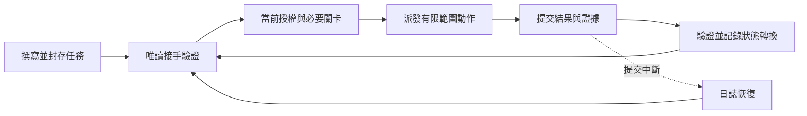

# Gastropact 蝸契

以 TaskContracts 為核心，讓跨對話、跨人員與 AI 代理協作的每一步都有跡可循。

[English](README.md)


> **可追溯的工作，可靠的交接。** 炒飯一定要有鍋氣，專案肯定要用蝸契。

[](#從這裡開始)
[](#命令與版本相容性)
[](LICENSE)

Gastropact 蝸契是以 TaskContracts 任務協定為核心的本機 Python 命令列工具，適合需要跨對話、跨人員或跨 AI 代理協作的開發者。它保存已授權的目標、記錄進度、核對提交證據，並協助恢復中斷的狀態轉換。

接手者可以核對四件事：**原本授權了什麼？哪些工作已記錄完成？下一步是什麼？還缺哪些證據或核准？**

> 目前為以原始碼提供的開發預覽版。Windows 與 Ubuntu WSL2 均已通過本機驗證，包含 Linux POSIX 檢查；遠端 CI 與實體斷電驗收仍未驗證。採用前請先閱讀[適用範圍與限制](#適用範圍與限制)；再使用條件請見 [MIT 授權條款](LICENSE)。

蝸牛代表「走過便留下痕跡」：如同黏液軌跡標示牠曾經走過的路，TaskContracts 保存任務進度與狀態轉換紀錄，讓後續檢查與交接有跡可循。


[開始使用](#從這裡開始) · [開發痛點](#解決哪些開發問題) · [運作流程](#任務如何向前推進) · [驗證狀態](#驗證狀態) · [使用限制](#適用範圍與限制)

## 從這裡開始

取得原始碼後，查看兩個命令列介面；以下命令不會變更任務：

```shell
git clone https://github.com/pingqLIN/Gastropact.git
cd Gastropact
python scripts/task_contract.py --help
python scripts/task_orchestrator.py --help
```

這兩個唯讀說明命令提供核心契約與自動化介面的入口；各自用途與版本邊界請見[命令與版本相容性](#命令與版本相容性)。

執行環境需要 Python 3.11 以上，使用 Python 標準函式庫。涉及儲存庫綁定的檢查需要 Git。儲存庫驗證另外需要 Node.js／npm、固定版本的 Ajv 相依套件，以及 PowerShell（`pwsh`）；CI 設定使用 Python 3.12 與 Node.js 22。

接手已撰寫的任務資料包時，先閱讀 `TASK.json` 與 `STATE.json`，再以 `resume --help` 查看必要的任務目錄與專案根目錄參數。`RESUME_OK` 代表接手驗證通過，**不等於執行核准**；授權缺少或不一致時會回報 `STOP`。

## 解決哪些開發問題

| 開發時遇到的問題 | 已實作的處理方式 | 實際效益 |
| --- | --- | --- |
| 新對話遺失目標、限制或停止位置。 | 封存契約與獨立進度快照保存在對話之外。 | 接手者可以檢查任務，不必從聊天內容重建授權。 |
| 小修改擴張成無關編輯或未核准的操作。 | 以允許動作、禁止動作、路徑限制及綁定動作的授權，約束派工與驗收。 | 受支援的協定流程會拒絕缺少或不符的授權。 |
| 在錯誤工作副本或非預期變更之上繼續工作。 | 核對專案／Git 綁定，以及實際觀察到的暫存區與工作目錄基線。 | 可拒絕錯誤狀態、未申報變更及超範圍的結果差異。 |
| 跳過前置工作，或驗收條件未通過便進入下一階段。 | 以動作圖、前序檢查、階段限定的提交授權與必要關卡約束轉換。 | 進度須遵循允許的順序與證據要求。 |
| AI 代理宣稱「完成」，卻提交過期、不相關或不完整的證據。 | 結果綁定任務、契約雜湊、修訂序號、動作、證據類別、驗證器，以及成果檔案摘要與大小。 | 綁定不符的證據與不完整驗證紀錄不能構成驗收依據。 |
| 兩個寫入者使用同一份舊快照，或過期持有者繼續提交。 | 修訂序號、作業系統寫入鎖與動作租約共同偵測控制權衝突。 | 過期更新會遭拒絕；過期租約恢復須具明確授權與稽核。 |
| 程序在寫入狀態、事件及回執之間中止。 | 使用原子狀態替換、摘要串接的稽核紀錄及預寫日誌支援恢復。 | 可核對並恢復中斷交易；無法解釋的缺口會停止處理。 |
| 重試提交相同結果兩次，或未核准便啟動後續動作。 | 精確核對重送綁定，對相同重試作冪等處理，並另外檢查後續動作授權。 | 本機轉換不必重複推進，下一步仍受授權關卡約束。 |
| 審查者找不到檢查點所依據的證據。 | 任務定義、進度、稽核事件與成果檔案具有不同角色及明確綁定。 | 能將已記錄的轉換與不符原因追溯至相關紀錄。 |

## 任務如何向前推進



每次轉換都必須通過適用檢查。檢查失敗便停止該路徑，不會因此取得修復或擴張任務的權限。

例如：開發者核准重構一個模組，要求回歸驗證證據，並將部署排除在授權範圍外。

1. 任務作者記錄目標、允許路徑、動作順序、驗收證據與核准要求，然後封存契約。
2. 接手者先做唯讀驗證；v1.2 自動化仍須取得當前動作的派工授權，並綁定修訂序號與工作區基線。
3. 若對話中斷，新接手者讀取同一資料包並重新驗證。驗證成功會指出已記錄進度；不符便停止。
4. 執行者提交變更路徑、產生的成果檔案與結構化驗證結果。自動化核對綁定後，才記錄狀態轉換。
5. 若提交中斷，日誌恢復會檢查待完成的交易。相同重試須對應同一轉換，後續動作仍須滿足自己的授權要求。

驗收條件是否足以證明預期行為，由開發者或統籌代理判斷；TaskContracts 核對這項決定周圍的協定與證據綁定。

## 每份檔案負責什麼

```text
<task-id>/
  TASK.json
  CONTRACT.sha256
  STATE.json
  events.jsonl
```

| 檔案或層次 | 責任 |
| --- | --- |
| `TASK.json` + `CONTRACT.sha256` | 封存的任務定義：目標、專案綁定、範圍、動作圖與驗收要求。 |
| `STATE.json` | 可變進度快照、修訂序號、當前動作、關卡、核准與阻礙。 |
| `events.jsonl` | 以附加方式保存的檢查點與狀態轉換稽核紀錄。 |
| 任務的 `.automation/` 目錄 | 自動化協定產生的派工、租約、日誌與回執紀錄。 |
| 專案成果檔案 | 任務引用的結果與驗證證據。 |
| 儲存庫治理 | 持續適用於每個任務的長期專案規則。 |

任務定義的效力仍低於平台／執行環境規則、當前使用者授權、有效的儲存庫指示、工具強制限制，以及適用的 Git、機密與風險政策。目標、範圍或驗收條件變更，須明確重新撰寫並封存，或建立接替契約。

本機開發任務預設存於 Git 已忽略的 `.local/tasks/<task-id>`，也支援外部任務根目錄。儲存庫內的任務目錄必須是明確選定的子目錄，不能等於專案根目錄。真實任務資料、憑證、備份與對話資料不應納入原始碼散布內容。

## 命令與版本相容性

| 介面 | 命令 | 用途 |
| --- | --- | --- |
| `scripts/task_contract.py` | `seal`、`resume`、`checkpoint`、`route-check`、`record-gate`、`resume-handoff` | 撰寫、檢查、驗證與記錄契約狀態。 |
| `scripts/task_orchestrator.py` | `dispatch`、`submit-result`、`status`、`recover`、`recover-lease` | 協調有限範圍動作及其可恢復結果。 |

精確參數請查閱各命令的 `--help`。封存、檢查點、關卡記錄、派工、提交及恢復可能寫入任務狀態，只能對選定任務執行已授權操作。驗收失敗不會撤銷執行者的編輯；恢復程序也不是通用檔案還原工具。

- **v1.0：**保留舊版核心流程，不會默默啟用新版語意。
- **v1.1：**支援動作圖、階段限定的提交授權、綁定關卡證據、修訂序號與原子狀態替換。檢查點須提供 `--expected-revision` 與 `--completed-action-id`。
- **v1.2：**加入明確自動化欄位，包括 `allowed_workspace_paths`、`executor_routes` 與 `authority_expansion`。自動化要求 v1.2 任務／狀態及 `taskcontracts-executor-result.v2` 提交格式。檢查點可記錄中斷快照；動作完成與終態 PASS 必須經過 `submit-result` 及綁定證據驗證。

`record-gate` 接受摘要綁定的證據。部分內建關卡專供其瀏覽器／引擎測試資料使用，必須精確滿足要求，不能視為通用瀏覽器相容性聲明。冒煙測試不能代替必要驗收證據。

## 驗證狀態

2026-09-10 的開發快照已在兩個環境通過完整本機儲存庫驗證：

| 環境 | 測試通過 | 跳過 | 失敗 |
| --- | ---: | ---: | ---: |
| Windows | 115 | 2 項 POSIX 專用案例 | 0 |
| Ubuntu WSL2／Python 3.12 | 117 | 0 | 0 |

八項 [v1.2 續接測試](tests/test_task_contract.py)涵蓋唯讀接手、拒絕透過檢查點直接完成或推進、過期修訂序號、舊格式完成事件、證據綁定的終態結果，以及重複提交。另以三項隔離反向檢查移除相關防護，對應測試均如預期失敗。

[耐久性測試](tests/test_durability.py)涵蓋原子替換與交易寫入前後的程序突然中止；[POSIX 鎖測試](tests/test_posix_lock.py)涵蓋鎖競爭及 `SIGKILL` 後的鎖釋放。這些是本機合成測試，WSL2 結果只證明該環境的行為，不代表遠端 CI 或實體斷電耐久性通過。較新的工作副本請以下列命令重新驗證。

## 適用範圍與限制

TaskContracts 適合跨對話或跨人員接手、有核准邊界、需要分階段驗收，或必須恢復中斷提交的工作。單人在同一對話就能完成並審查的小修改，通常可先使用既有儲存庫流程。

規格與議題追蹤工具負責定義工作及安排優先順序，儲存庫治理制定長期規則，AI 代理執行環境負責執行動作；TaskContracts 在其間補上特定任務的授權、進度與證據檢查。

重要邊界：

- **授權與存取：**命令列工具驗證自己的協定，存取權限由執行環境／工具落實。它不會隔離所有執行者操作，也無法阻止協定之外的直接檔案寫入。
- **完整性與信任：**SHA-256 相對於可信摘要偵測變更，不是數位簽章；契約與摘要同時被替換時，無法據此認證作者。固定的本機成果驗證器不認證外部執行者，也不證明任意執行聲明的語意真實性。
- **恢復：**符合綁定的本機結果重送具有冪等性；外部副作用不因此獲得「只執行一次」的保證。備份仍有必要。
- **耐久性：**本機程序突然中止測試涵蓋寫入與交易邊界；實體斷電、儲存控制器快取、檔案系統日誌重播及 Windows 目錄項目持久性仍未驗證。
- **平台與整合：**Windows 與 Ubuntu WSL2 已通過本機驗證；已設定的 Windows／Ubuntu 遠端 CI 仍須取得自己的成功執行證據。此本機工具尚未提供通用執行環境轉接器與託管協調服務。

## 驗證原始碼

下列命令將儲存庫鎖定的驗證相依套件安裝至 `node_modules`，不會安裝全域命令列工具。執行前請先檢閱相依套件檔案：

```shell
npm ci --ignore-scripts
pwsh -File automation/verify.ps1
```

預期完成標記為 `PASS repository_gate`。此程序檢查 JSON、Python 語法、四份 Draft 2020-12 結構描述及正負測試資料、原始碼／執行資料邊界，以及單元測試。程序本身不會安裝缺少的相依套件；Ajv 缺少或版本不相容時會失敗。

Windows 會跳過 POSIX 專用測試。請將跳過項目與整體結果分開判讀；本機驗證通過不代表遠端 CI、部署或正式環境驗收完成。

## 參考資料與貢獻

- [任務範本](templates/TASK.json)與[狀態範本](templates/STATE.json)：撰寫真實任務前先檢查版本化欄位；範本不是已授權、可直接執行的任務。
- [契約結構描述](schema/task-contract.schema.json)、[狀態結構描述](schema/state.schema.json)與[結果結構描述](schema/executor-result.schema.json)：機器可讀的資料結構。
- [交接引用結構描述](schema/handoff-task-contract-ref.schema.json)：為既有交接流程引用資料包，不授予狀態寫入能力。

目前尚未建立專用貢獻指南與安全問題通報政策。準備變更時請使用合成測試資料及適當測試，排除真實任務資料包、憑證與對話資料。此處尚未記載公開支援承諾或私密漏洞通報管道。

## 授權條款

本專案採用 [MIT 授權條款](LICENSE)。散布副本或實質部分時，請保留著作權聲明與授權許可文字。